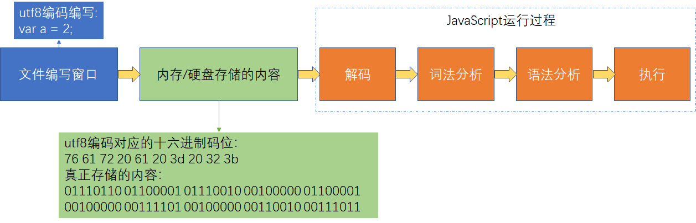

# JavaScript

JavaScript 的主要功能是响应用户对网页的行为，从而更改网页内容和展示形式。对任何编程语言来说，必定是**用规定的文法，表达特定语义，最终操作运行时**。

一般来说，**程序=算法+数据结构**，对运行时来说，执行过程就是算法，类型就是数据结构。

JavaScript 文件从编写到执行的过程为：

图中，编写 JavaScript 文件并以二进制流的形式存储。当需要执行这个文件时，将文件以二进制流的形式读取出来，交给 JavaScript 引擎去解码、词法分析、语法分析、执行。

本文根据 [262 标准](http://www.ecma-international.org/ecma-262/10.0/)，从小到大拆解 JavaScript 的文法和运行时。

- Atom - 词法解析
  - grammar
    - `lexical.md`
    - `type.md`
  - grammar && runtime
    - `object.md`
    - `symbol.md`
  - runtime
    - `type-convert.md`
- Expression - 表达式
  - grammar && runtime
    - `expression.md`
- Statement - 语句
  - grammar && runtime
    - `statement.md`
- Structual - 函数调用 -> 宏任务和微任务 -> JavaScript Context
  - runtime
    - `structual.md`
