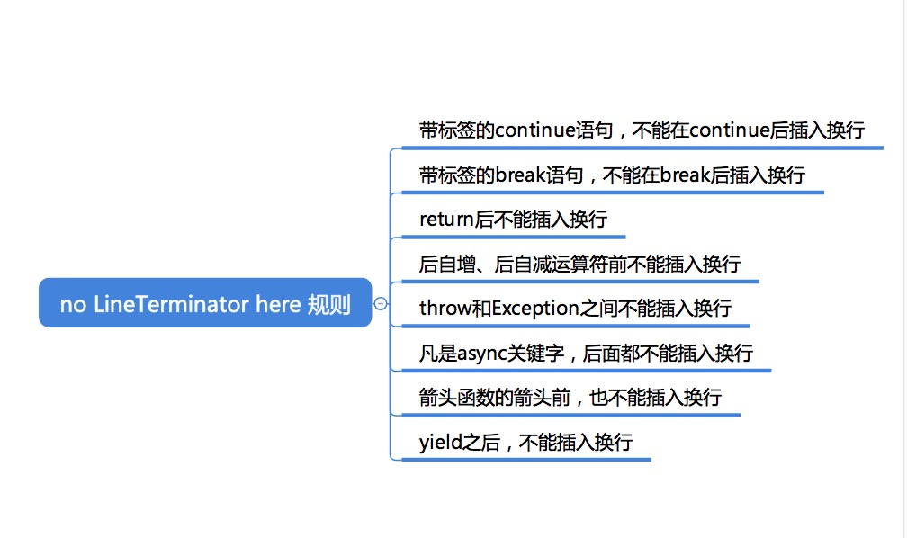

# 词法分析

词法规定了语言的最小语义单元，也就是 token。词法分析的步骤是将输入的字符流根据规则，组合成一个个 token。词法分析的工具主要有**状态机**或**正则表达式**。

词法分析阶段主要讲讲 262 标准中的 [lexical grammar](http://www.ecma-international.org/ecma-262/10.0/#sec-lexical-grammar)。

JavaScript 的词法分析过程和其他语言大体类似，但是由于 JavaScript 中有除法 `/` 和正则 `//`，这就导致有两种可能；还由于有字符串模板 `${xxx}`和 `}`，这又是两种可能性，所以标准中写得很乱：

1. 除法和正则表达式直接量冲突

   除法的写法包括 `/` 和 `/=`，正则表达式直接量的写法为 `/abc/`，JavaScript 的词法分析器是无法区分这两点的。所以 JavaScript 定义了 2 组词法，然后靠语法分析传一个标志给词法分析器，以此决定使用哪套词法。

2. 字符串模板中 `}` 的特殊性

   字符串模板的一般写法为 `Hello, ${name}` 这种形式。理论上来说，`${}` 中可以写任何 JavaScript 表达式。但在这种情况下，由于 `}` 是 `${}` 的结尾，所以其中不能有 `}`。

以上两种情况相乘就是四种词法定义：

- InputElementDiv::
  - WhiteSpace
  - LineTerminator
  - Comment
  - Token
    - CommonToken
    - DivPunctuator
    - RightBracePunctuator
- InputElementRegExp::
  - WhiteSpace
  - LineTerminator
  - Comment
  - Token
    - CommonToken
    - RightBracePunctuator
    - RegularExpressionLiteral
- InputElementRegExpOrTemplateTail::
  - WhiteSpace
  - LineTerminator
  - Comment
  - Token
    - CommonToken
    - RegularExpressionLiteral
    - TemplateSubstitutionTail
- InputElementTemplateTail::
  - WhiteSpace
  - LineTerminator
  - Comment
  - Token
    - CommonToken
    - DivPunctuator
    - TemplateSubstitutionTail

为了便于理解，需要简单化一下。

## WhiteSpace 空白字符

JavaScript 支持 Unicode 中所有的空白字符。

- `<HT>`(或称 `<TAB>` ) 是 `U+0009`，是缩进 TAB 制表符，也就是字符串中写的 `\t`。制表符有一个很有意思的特性，就是如果你设置了 Tab 表示 4 个空格，然后在某个位置打了 2 个空格，之后按 TAB 键，你会发现当前 TAB 只占用 2 个空格了，这就很方便制表了。
- `<VT>` 是 `U+000B`，也就是垂直方向的 TAB 符 `\v`，这个字符在键盘上很难打出来，所以很少用到。
- `<FF>` 是 `U+000C`，Form Feed，分页符，字符串直接量中写作 `\f` ，现代已经很少有打印源程序的事情发生了，所以这个字符在 JavaScript 源代码中很少用到。
- `<SP>` 是 `U+0020`，就是最普通的空格了。在文字排版中，在空格处会发生发生断行，比如一段长文本显示在浏览器中，当我们缩小浏览器窗口，会发现文本会在 SP 空格处发生断行。如果你不想断行，需要将 `<SP>` 换成 `NBSP`。
- `<NBSP>` 是 `U+00A0`，非断行空格，它是 SP 的一个变体。在文字排版中，可以避免因为空格在此处发生断行，其它方面和普通空格完全一样。多数的 JavaScript 编辑环境都会把它当做普通空格（因为一般源代码编辑环境根本就不会自动折行。。。。。。）。HTML 中，很多人喜欢用的 `&nbsp;` 最后生成的就是它了。
- `<ZWNBSP>`(旧称 `<BOM>`) 是 `U+FEFF`，这是 ES5 新加入的空白符，是 Unicode 中的零宽非断行空格，在以 UTF 格式编码的文件中，常常在文件首插入一个额外的 `U+FEFF`，解析 UTF 文件的程序可以根据 `U+FEFF` 的表示方法猜测文件采用哪种 UTF 编码方式。这个字符也叫做 “bit order mark”。这是一个遗留技术，可能以后会给你工作中挖坑。

在开发时，最好只用 `<SP>`。

## LineTerminator 换行符

- `<CR>` 是 `U+000D`，这个字符真正意义上的“回车”，在字符串中是 `\r`。在一部分 Windows 风格文本编辑器中，回车是两个字符 `\r\n`，所以在开发时，我们会使用 git 等工具做转换，使回车表示为 `\r`。
- `<LF>` 是 `U+000A`，就是最正常换行符，在字符串中的 `\n`
- `<LS>` 是 `U+2028`，是 Unicode 中的行分隔符
- `<PS>` 是 `U+2029`，是 Unicode 中的段落分隔符

关于 `<LF>` 和 `<CR>`，是沿用了老式打印机换行时的步骤的名称，老式打印机在换行打印时，会执行两个步骤：

1. 打印头回到车头，也就是 `<CR>`
2. 打印的纸张移到下一行，也就是 `<LF>`

在开发时，最好只用 `<LF>`。

## Comment 注释

注释主要有两种：

```javascript
/* MultiLineCommentChars */

// SingleLineCommentChars
```

## Token 词

token 就是除了上面三种，留下来的有效信息。可以使用[esprima](http://esprima.org/demo/parse.html)在线得到代码的 tokens。注意，Token 中是没有 ObjectLiteral 的，ObjectLiteral 在语法解析阶段解析。

### IdentifierName 标识符名称

典型案例是我们使用的变量名，注意这里关键字也包含在内了。可以以美元符 `$`、下划线 `_` 或者 Unicode 字母开始，除了开始字符以外，IdentifierName 中还可以使用 Unicode 中的连接标记、数字、以及连接符号。可以分为：

- Keywords
- Identifier
- Future reserved keywords

### Punctuator 符号

我们使用的运算符和大括号等符号，包括：

`{ ( ) [ ] . ... ; , < > <= >= == != === !== + - * % ** ++ -- << >> >>> & | ^ ! ~ && || ? : = += -= *= %= **= <<= >>= >>>= &= |= ^= => / /= }`

### Literal 字面量

- Numeric Literal 数字直接量
- String Literal 字符串直接量，就是我们用单引号或者双引号引起来的直接量
- Template Literal 字符串模板，用反引号括起来的直接量 `a${b}c${d}e`

  Template 字符串模板比较有意思：

  ```javascript
  `a${b}c${d}e`;
  ```

  在词法阶段拆分为：

  ```text
  `a${
  b
  }c${
  d
  }e`
  ```

  模板还支持添加处理函数的写法。这时模板的各段会被拆开，传递给函数当参数：

  ```javascript
  function f() {
    console.log(arguments);
  }

  var a = "world";
  f`Hello ${a}!`; // [["Hello", "!"], world]
  ```

- Null Literals
- Boolean Literals
- Regular Expression Literal 正则表达式直接量有自己的语法规则，在词法阶段，仅会对它做简单解析。

  ```javascript
  /RegularExpressionBody/g;
  ```

## 自动插入分号规则

JavaScript 语言提供了自动插入分号规则:

- 有换行符，且下一个符号是不符合语法的，那么就尝试插入分号。

  ```text
  let a = 1
  void function(a){
    console.log(a);
  }(a);
  ```

  上面的例子中，由于 1 后面加 void 是不符合语法的，所以会在 void 前尝试插入分号：

  ```text
  let a = 1
  ;void function(a){
  console.log(a);
  }(a);
  ```

- 有换行符，且语法中规定此处不能有换行符(no LineTerminator here 规则)，那么就在该换行符处自动插入分号。

  

  ```text
  var a = 1, b = 1, c = 1;
  a
  ++
  b
  ++
  c

  ```

  在上面这个例子中，a 后面有换行符，而后自增前是不能有换行符的，所以在 a 后面自动插入分号，最后的结果是：

  ```text
  var a = 1, b = 1, c = 1;
  a;
  ++
  b;
  ++
  c;
  ```

- 源代码结束处，不能形成完整的脚本或者模块结构，那么就自动插入分号。

关于写代码时候要不要写分号，根据项目的代码规范而定，可以使用 eslint/prettier 等工具进行自动化。尤雨溪曾经在知乎说：真正会导致上下行解析出问题的 token 有 5 种：以括号，方括号，正则开头的斜杠，加号，减号为行首。我还从没见过实际代码中用正则、加号、减号作为行首的情况，所以总结下来就是一句话：

> 一行行首是括号或者方括号的时候加上分号就可以了，其他时候全部不需要。
