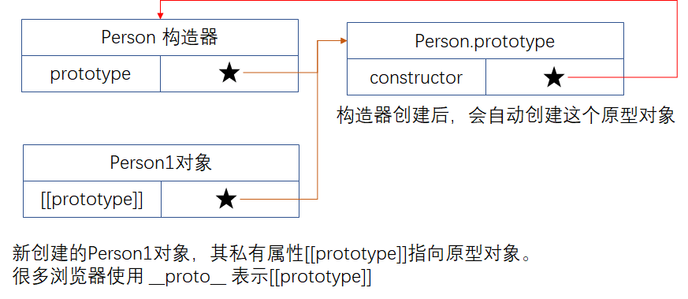
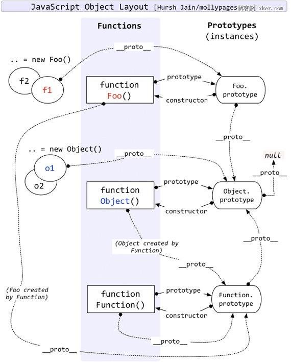
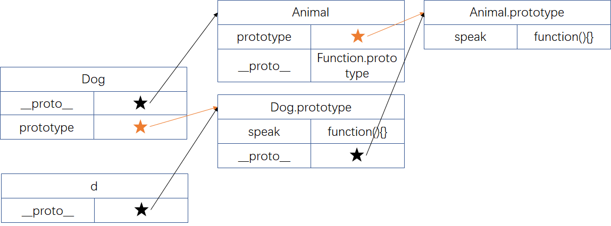
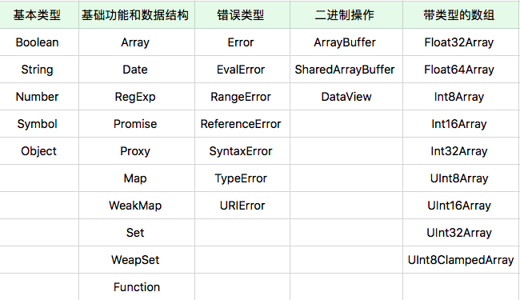

# Object 类型

JavaScript 是面向对象的语言，**使用了原型来描述语言中的对象**。Java/C++ **使用类来描述语言中的对象**。然而很不幸，因为一些公司政治原因，JavaScript 推出之时受管理层之命被要求模仿 Java，所以，JavaScript 创始人 Brendan Eich 在“原型运行时”的基础上引入了 new、this 等语言特性，使之“看起来更像 Java”，这也给有了 Java 基础的人士一些误导。

其实理解面向对象应该从运行时角度去理解，因为任何语言代码都绕不开运行时的对象模型。从运行时角度来说，类的概念是被弱化的。

一个对象的典型定义方式：

```javascript
var o = {
  d: 1,
  f() {
    console.log(this.d); // 函数是一种特殊 Object
  },
};
```

## 对象的特征

- 对象具有**唯一标识性**：即使完全相同的两个对象，也并非同一个对象
- 对象有**状态**：对象具有状态，同一对象可能处于不同状态之下
- 对象具有**行为**：即对象的状态，可能因为它的行为产生变迁

在 JavaScript 中，状态和行为统一抽象为属性。同时，JavaScript 赋予了使用者在运行时为对象添加、修改属性（状态和行为）的能力。

## 狗咬人的对象设计模式

假设现在设计狗咬人这个功能，那么，“咬”这个行为该如何使用对象进行抽象？

答案是需要在人的对象上进行抽象。因为在设计对象的状态和行为时，我们需要遵循**行为改变状态**的原则，而狗咬人，咬只是业务需求，人会感到痛，改变的是人的状态，所以行为也需要在人这个对象上定义。

```javascript
class Human {
  hurt(damage) {
    // ...
  }
}
```

## 对象是属性的集合

实际上，JavaScript 对象的运行时就是一个“属性（key: value）的集合”，属性分为`数据属性`和`访问器属性`，状态和行为都用“属性”表示，其中，key 可以是 String 类型或 Symbol 类型，属性值 value 可以是任何类型。

属性并非只是简单的名称和值，JavaScript 用一组特征值（以数据属性特征值或者访问器属性特征值）来描述属性值 value。

一般来说，数据属性用于描述状态，访问器属性则用于描述行为。数据属性中如果存储函数也可以用于描述行为。

获得属性特征值的方法是 `Object.getOwnPropertyDescripter()`，设置属性特征值的方法是 `Object.defineProperty()`。

定义属性值时，就会定义属性特征值：

```javascript
let a = {
  name: "frank",
};
a.age = 10086;
var o = {
  get a() {
    return 1;
  },
};
```

### 数据属性特征值

数据属性主要目的是用于描述属性的值。访问器属性使得属性在读和写时执行代码，它允许使用者在写和读属性时，得到完全不同的值，它可以视为一种函数的语法糖:

数据属性的特征包括：

- `[[value]]`：就是属性的值。
- `[[writable]]`：决定属性能否被赋值。默认为 true。
- `[[enumerable]]`：决定 for in 能否枚举该属性。默认为 true。
- `[[configurable]]`：决定该属性能否能被删除或者改变特征。默认为 true。

```javascript
// 第一种定义数据属性方法
var o = { a: 1 };

// 第二种定义数据属性方法
o.b = 2;

// 第三种定义数据属性方法
o["name"] = "frank";

// 得到数据属性特征
Object.getOwnPropertyDescriptor(o, "a"); // {value: 1, writable: true, enumerable: true, configurable: true}
Object.getOwnPropertyDescriptor(o, "b"); // {value: 2, writable: true, enumerable: true, configurable: true}

// 定义/修改数据属性特征。
// 第四种定义数据属性方法。
Object.defineProperty(o, "c", {
  value: 3,
  writable: false, // 使 c 属性无法被重写
  enumerable: false,
  configurable: true,
});
Object.getOwnPropertyDescriptor(o, "a"); // {value: 1, writable: true, enumerable: true, configurable: true}
Object.getOwnPropertyDescriptor(o, "c"); // {value: 3, writable: false, enumerable: false, configurable: true}
o.c = 4;
console.log(o.c); // 3
```

### 访问器属性特征值

访问器属性分为 getter 属性和 setter 属性。访问器属性跟数据属性不同，每次访问属性都会执行 getter 或 setter。

访问器属性的特征包括：

- `[[getter]]`：函数或 undefined，在取属性值时被调用。
- `[[setter]]`：函数或 undefined，在设置属性值时被调用。
- `[[enumerable]]`：决定 for in 能否枚举该属性。
- `[[configurable]]`：决定该属性能否被删除或者改变特征。

访问器属性的定义方法包括：

```javascript
// 第一种定义方法
var o = {
  a: 7,
  get b() {
    return this.a + 1;
  },
  set c(x) {
    this.a = x / 2;
  },
};

console.log(o.a); // 7
console.log(o.b); // 8. Runs the getter
o.c = 50; // Runs the setter
console.log(o.a); // 25

// 第二种定义方法
var o = { a: 0 };

Object.defineProperty(o, "b", {
  set: function (x) {
    this.a = x / 2;
  },
});

o.b = 10; // Runs the setter, which assigns 10 / 2 (5) to the 'a' property
console.log(o.a); // 5
```

## 原型

**JavaScript 实现面向对象的方式是使用原型**。“基于原型”的编程看起来更为提倡程序员去关注一系列对象实例的行为，而后才去关心如何将这些对象，划分到最近的使用方式相似的原型对象，而不是将它们分成类。

Java 等语言实现面向对象的方式是使用类。“基于类”的编程提倡使用一个关注类和类之间关系的开发模型。在这类语言中，**总是先有类，再从类去实例化一个对象**。类与类之间又可能会形成继承、组合等关系。类又往往与语言的类型系统整合，形成一定编译时的能力。

基于原型的面向对象系统**通过“复制”的方式来创建新对象**。主要有两种实现思路：

- 一个是并不真的去复制一个原型对象，而是使得新对象持有一个原型的引用。**JavaScript 选择了这种实现方式**。
- 另一个是切实地复制对象，从此两个对象再无关联。

JavaScript 原型系统的原理：



- 所有对象都有私有字段 `[[prototype]]`，就是对象的原型。
- 读一个属性，如果对象本身没有，则会继续访问对象的原型，直到原型为空或者找到为止。

当我们访问属性时，如果当前对象没有，则会沿着原型找原型对象是否有此名称的属性，而原型对象还可能有原型。因此，会有**原型链**这一说法。这一算法保证了每个对象只需要描述自己和原型的区别即可。

我们来看一下几个概念的区别 : `[[prototype]]` VS `__proto__` VS `prototype`



- `[[prototype]]` 是所有对象都有的**私有字段**，也就是该对象的原型。`b.[[prototype]]` 就是指向 b 对象的原型。但是，`[[prototype]]` 是对象的私有字段，不能直接使用`b.[[prototype]]`来获得该对象的原型。如上图中，f1 对象的 `[[prototype]]` 指向 `Foo.prototype`。
- `__proto__` 是已经过时的 API, 在很多浏览器中，使用 `__proto__` 表示 `[[prototype]]`。`b.__proto__` 用来得到 b 对象的原型。现在的获得 b 对象原型的 API 是 `Object.getPrototypeOf(b)`
- `构造器对象.prototype` 是只有构造器(constructor functions)才有的**私有属性**。具体可参考上图所示的构造器 Foo。

## ES6 中的类

在早期版本的 JavaScript 中，“类”的定义是一个私有属性 `[[class]]`，语言标准为内置类型诸如 Number、String、Date 等指定了 `[[class]]` 属性，以表示它们的类。语言使用者唯一可以访问 `[[class]]` 属性的方式是 `Object.prototype.toString()`。

从 ES5 开始，`[[class]]` 私有属性被 `Symbol.toStringTag` 代替，`Object.prototype.toString()` 的意义从命名上不再跟 class 相关。我们甚至可以自定义 `Object.prototype.toString()` 的行为，以下代码展示了使用 `Symbol.toStringTag` 来自定义 `Object.prototype.toString()` 的行为：

```javascript
var o = { [Symbol.toStringTag]: "MyObject" };
console.log(o + ""); // [object MyObject]
```

ES6 中加入了新特性 class，使用 `new 构造器()` 搭配来模拟 Java 的怪异行为终于可以退休了（虽然运行时没有改变）。

在任何场景，都推荐使用 ES6 的语法来定义“类”，而令 function 回归原本的函数语义。也就是说，**当使用“类”的思想来设计代码时，推荐放弃使用 ES6 之前使用的`new 构造器()`的方式生成对象，改为使用 `new SomeClass()` 来生成对象**。

ES6 在标准中删除了所有 `[[class]]` 相关的私有属性描述，类的概念正式从属性升级成语言的基础设施，从此，基于类的编程方式也成为了 JavaScript 的官方编程范式。

为了避免蹩脚的 `new 构造器对象`的形式 ，令 function 回归原本的函数语义,当我们使用类的思想来设计代码时，应该尽量使用 class 来声明类，而不是用旧语法拿函数来模拟对象。class 关键字和箭头运算符可以完全替代旧的 function 关键字，这更明确地区分了定义函数和定义类两种意图:

1. 定义函数：使用箭头函数
2. 定义对象：使用 class

```javascript
class Rectangle {
  constructor(height, width) {
    this.height = height; // 当创建对象后，对应对象的数据属性
    this.width = width;
  }
  // Getter 当创建对象后，对应对象的访问器 getter 属性
  get area() {
    return this.calcArea();
  }
  // Method  当创建对象后，对应对象的方法属性
  calcArea() {
    return this.height * this.width;
  }
}

const r = new Rectangle(10, 100); // 创建 Rectangle 对象 r
r.area; // 1000
```

ES6 引进 class 后，还有了类继承的概念：

```javascript
class Animal {
  constructor(name) {
    this.name = name;
  }

  speak() {
    console.log(this.name + " makes a noise.");
  }
}

class Dog extends Animal {
  constructor(name) {
    super(name); // call the super class constructor and pass in the name parameter
  }

  speak() {
    console.log(this.name + " barks.");
  }
}

let d = new Dog("Mitzie");
d.speak(); // Mitzie barks.
```



## 面向对象的 API

- 基本的对象能力
  - 创建对象
    - 字面量
      - `var o = []`
      - `var o = {}`
      - `var o = /abc/`
    - new
      - `var o = new Object();`
    - dom api
      - `var o = document.createElement("div")`
    - 通过内置对象
      - `var o = Object.create()`
      - `var o = Object.assign({},{name: "frank"})`
      - `var o = JSON.parse("{}")`
    - 通过装箱
      - `var o = Object()`
  - 访问属性
    - `a.b`
    - `a[b]`
  - 定义属性
    - `Object.defineProperty()`
- 原型相关 API

  - 根据指定的原型创建新对象，原型可以是 null

    `Object.create` 是常用的创建对象并指定该对象原型的方法。

    

    ```javascript
    var myObject = {
      a: 2,
    };
    var anotherObject = Object.create(myObject);
    anotherObject.a; // 2
    ```

  - 获得原型

    `Object.getPrototypeOf()`

  - 设置原型

    ```javascript
    var a = {};
    Object.getPrototypeOf(a) === Object.prototype; // 常用的获得对象的原型的方法
    a.__proto__ === Object.prototype; // true
    ```

- new + class + extends 基于类的 API
- new + function + prototype 模拟 Java 的 API，在现在最好不要用了

  ```javascript
  function Foo() {
    // ...
  }

  var a = new Foo();
  // var a = new Foo; // new后面可有可无()，最好使用有()的写法。

  Object.getPrototypeOf(a) === Foo.prototype; // true
  a.__proto__ === Foo.prototype; // true
  ```

  当普通函数调用时前面加了 new，该函数成为**构造器**。`new 构造器()` 要和原型一起理解。

  new 主要用于新建一个对象，新对象的原型就是构造器的 prototype 属性。`new 构造器()`时发生了：

  1. 以构造器的 prototype 私有属性为原型，创建新对象
  2. 将 this 和调用参数传给构造器并执行
  3. 如果构造器返回的是对象，则返回；否则返回第一步创建的对象

  通过分析 new 发生的过程，可以知道发现有两种给对象添加属性的方法：

  1. 构造器中添加

     ```javascript
     function c1() {
       this.p1 = 1;
       this.p2 = function () {
         console.log(this.p1);
       };
     }
     var o1 = new c1();
     o1.p2(); // 1
     ```

  2. 构造器的 prototype 属性上添加

     ```javascript
     function c2() {}

     c2.prototype.p1 = 1;
     c2.prototype.p2 = function () {
       console.log(this.p1);
     };

     var o2 = new c2();
     o2.p2(); // 1
     ```

## 对象分类

### 宿主对象（Host Objects）

宿主对象就是 JavaScript 宿主环境提供的对象。如浏览器的 window，node 的 global。全局对象 window 的属性一部分来自浏览器环境，一部分来自 JavaScript 语言。

### 内置对象（Built-in Objects）

- 固有对象（Intrinsic Objects）

  由标准规定，随着 JavaScript 运行而自动创建的对象实例。固有对象在任何 JavaScript 代码执行前就已经被创建出来了，它们通常扮演者类似基础库的角色。如 `Array` 等。

- 原生对象（Native Objects）

  

  以上使用 `new 构造器()`创建出的新的对象就是原生对象。**几乎所有这些构造器的能力都是无法用纯 JavaScript 代码实现的，它们也无法用 class/extend 语法来继承**。这些新创建的对象就是原生对象。

  这些使用构造器创建的对象多数使用了私有字段, 例如：

  - Error: `[[ErrorData]]`
  - Boolean: `[[BooleanData]]`
  - Number: `[[NumberData]]`
  - Date: `[[DateValue]]`
  - RegExp: `[[RegExpMatcher]]`
  - Symbol: `[[SymbolData]]`
  - Map: `[[MapData]]`

  这些私有字段使得原型继承方法无法正常工作。

  ```javascript
  // b 没法使用原型链
  Array.sayHi = function () {
    console.log("hi");
  };
  Array.sayHi(); // hi

  const b = new Array([2, 3, 4]);
  b.__proto__ === Array.prototype; // true
  b.sayHi();
  // VM1340:1 Uncaught TypeError: b.sayHi is not a function
  //  at <anonymous>:1:3
  ```

  所以我们可以认为，所有这些创建的原生对象都是为了特定能力或者性能，而设计出来的“特权对象”。我们再探讨更加奇特的对象。

  - 函数对象

    除了一般对象的属性和原型，函数对象还具有 [[call]] 私有字段，可以去作为函数被调用。

    我们用 JavaScript 中的 function、箭头函数、Function 构造器创建的对象，都具有 [[call]] 这个行为。

    当我们用类似 `f()` 等语法把对象当作函数执行时，会访问到 [[call]] 这种行为。如果对象没有 [[call]] 这种行为，则会报错。

  - 构造器对象

    除了一般对象的属性和原型，构造器对象还具有私有字段 [[construct]]，可以作为构造器被调用。

    执行 `new 构造器对象(参数)` 之后发生的事情:

    1. 以构造器对象的 prototype 属性（注意与私有字段[[prototype]]的区分）为原型，创建新对象
    2. 将 this 和调用参数传给构造器对象，执行
    3. 如果构造器对象返回的是对象，则返回，否则返回第一步创建的对象

  用户用 function 关键字创建的对象必定同时是函数对象和构造器对象。

  JavaScript 中用**对象模拟函数和构造器**的设计方式代替了一般编程语言中的函数，它们可以像其它语言的函数一样被调用、传参。任何宿主只要提供了“具有 `[[call]]` 私有字段的对象”，就可以被 JavaScript 函数调用语法支持。`[[call]]` 私有字段必须是一个引擎中定义的函数，需要接受 this 值和调用参数，并且会产生域的切换

  我们可以这样说，任何对象只需要实现 `[[call]]`，它就是一个函数对象，可以去作为函数被调用。

  而如果它能实现 `[[construct]]`，它就是一个构造器对象，可以作为构造器被 new 调用。

  对于为 JavaScript 提供运行环境的程序员来说，只要字段符合，就能用对象模拟函数和构造器：

  - 对于宿主和内置对象来说，它们实现 `[[call]]`（作为函数被调用）和 `[[construct]]`（作为构造器被调用）不总是一致的。

    ```javascript
    console.log(new Date()); // 1
    console.log(Date());
    ```

  - 对于用户使用 function 语法或者 Function 构造器创建的对象来说，`[[call]]` 和 `[[construct]]` 行为总是相似的。

    用户用 **function 语法定义函数就是同时定义了函数对象和构造器对象**。

    ```javascript
    function f() {
      return 1;
    }
    var v = f(); // 把 f 作为函数调用
    var o = new f(); // 把 f 作为构造器调用
    v; // 1
    o.__proto__ === f.prototype; // true
    ```

    `[[call]]` 的执行过程就是执行函数。

    `[[construct]]` 的执行过程如下：

    - 以 `Object.protoype` 为原型创建一个新对象
    - 以新对象为 this，执行函数的 `[[call]]`
    - 如果 `[[call]]` 的返回值是对象，那么，返回这个对象，否则返回第一步创建的新对象

  - ES6 之后，`()=>{}` 箭头函数写法，只能作为函数对象，无法作为构造器对象。

- 普通对象（Ordinary Objects）

  由{}语法、构造器对象(开发者自己通过 function 构建)或者 class 关键字定义类创建的对象，它能够被原型继承。
