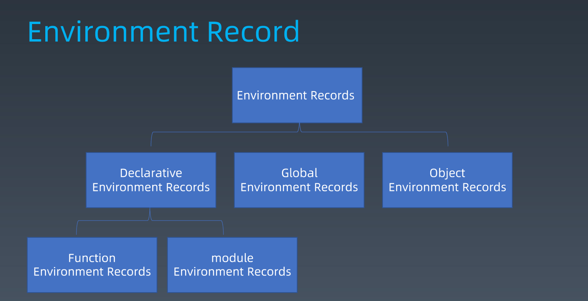
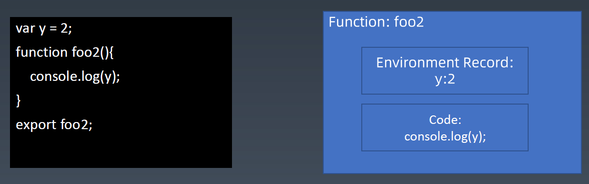
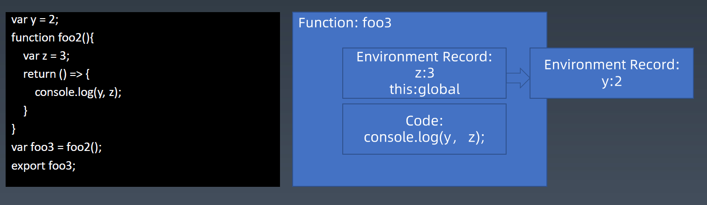
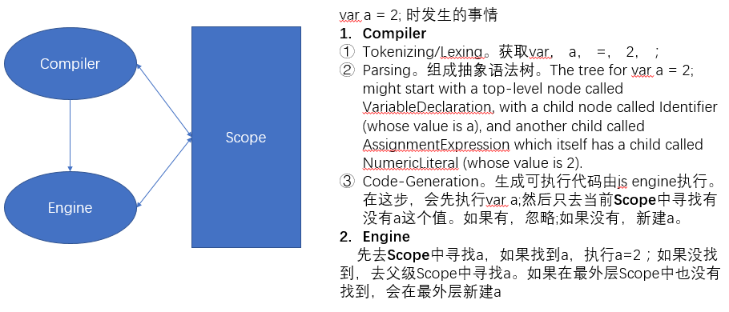
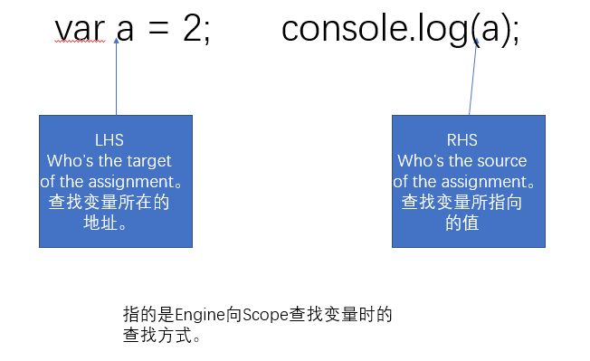
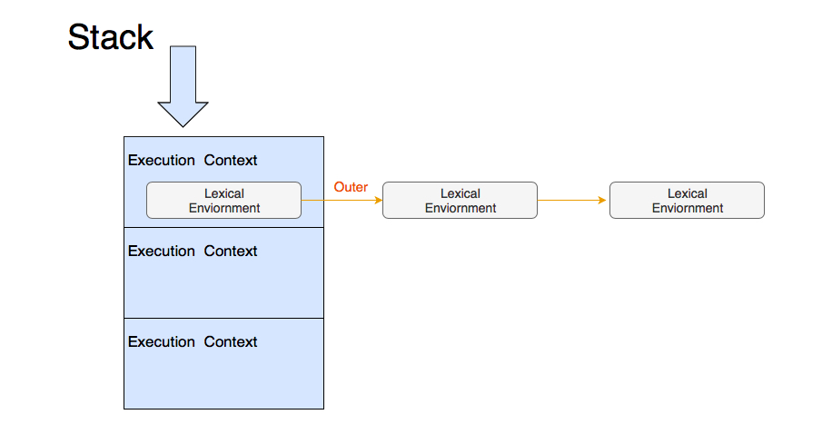
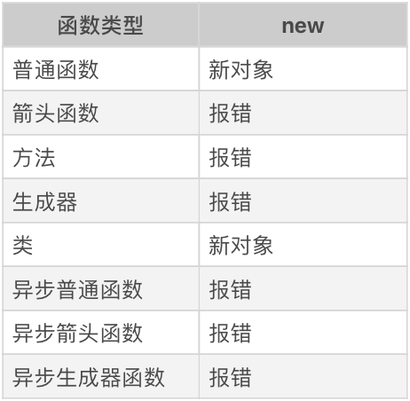
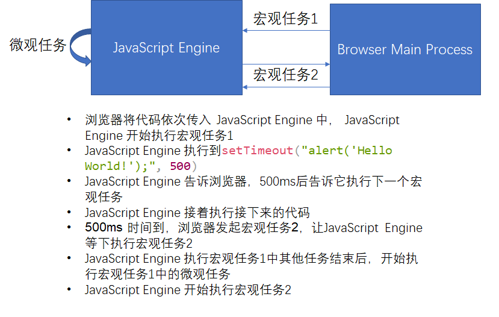

# 结构化程序设计和执行过程

## 函数调用（Execution Context）

Execution Context 就是函数执行上下文。JavaScript 引擎在执行 JavaScript 代码时，存在一个 Execution Context Stack，这个 Stack 中存在多个 Execution Context。处于栈顶的叫做 Running Execution Context。

当执行一个函数时，会新建一个 Execution Context 并 push 进 Execution Context Stack 栈顶；当这个函数执行完毕后，将这个 Execution Context 从 Execution Context Stack 栈顶 pop 出来。

每个 Execution Context 中，至少包含：

- code evaluation state： 主要用于 async/await 和 generator 函数，用于恢复代码执行位置
- Function 执行的任务是函数时使用，表示正在被执行的函数
- Script or Module 执行的任务是脚本或者模块时使用，表示正在被执行的代码
- Generator 仅生成器上下文有这个属性，表示当前生成器
- Realm 使用的基础库和内置对象实例
- LexicalEnvironment 词法环境，当获取变量或者 this 值时使用
- VariableEnvironment 变量环境，是历史遗留的包袱，仅仅用于处理 var 声明

### 函数的执行过程


函数的执行过程涉及环境部分和函数本身。

- 环境部分：指函数是在哪种环境下被调用的，它内部的变量是怎么定义的。普通变量和 this 处理方式不同。
- 函数本身：包含函数本身的执行逻辑。

### 闭包(Closure)就是绑定了执行环境的函数

闭包的广义定义：一种包含环境部分的 λ 表达式。

在 JavaScript 中，闭包的狭义定义：当内部函数是在定义它的词法作用域之外（外部函数）执行，仍然可以记住并访问它所在的词法作用域，这时就产生了闭包。即一个函数在它定义的词法作用域之外被调用，就是闭包。

从闭包的广义定义可以知道，JavaScript 中的函数完全符合闭包的定义。它的环境部分是函数词法环境部分组成，它的标识符列表是函数中用到的未声明变量，它的表达式部分就是函数体。闭包其实就是一小部分 JavaScript 函数，JavaScript 函数的范围比闭包广。闭包是绑定了执行环境的函数。包含:

1. 环境部分
   1. 环境: 对应 JavaScript 函数中的词法环境和变量环境(执行上下文的一部分)
   2. 标识符列表: 对应 JavaScript 函数中用到的在该函数外声明的变量
2. 表达式部分: 对应 JavaScript 函数中的函数体，也就是执行逻辑

### LexicalEnvironment

词法环境，当获取变量或者 this 值时使用。主要包含：

- this
- new.target
- super
- 变量

> A Lexical Environment consists of an Environment Record and a possibly null reference to an outer Lexical Environment.



Environment Record 主要分为：

- Declarative Environment Record
- Object Environment Record
- **Function Environment Record**

  这就关联到我们熟悉的 Closure 了。我们来看下面的代码：

  

  ```javascript
  var y = 2;
  function foo2(){
    console.log(y);
  }
  export foo2;
  ```

  当外部调用 foo2 时，当前的 Environment Record 包含 `y = 2`，当前的 表达式 code 是 `console.log(y);`，这就是为什么能打印处 y。

  我们来看看一个更复杂的情况：

  

  从图中可以看到，Function 3 中的 Environment Record 有一个 reference，指向 outer 的 Environment Record。

- Global Environment Record
- **Module Environment Record**

对普通变量（`var` 或 `let/const` 定义的变量）运行时来说没有多大区别，都遵**继承定义时环境**的规则。

但是，this 关键字比较特殊，它是**由运行时决定的**。

### Realm

Realm 提供了一套完整的 JavaScript 内置对象。一般的，内置对象是全局对象的属性。在浏览器中，可以使用 iframe 额外生成一套 Realm。

在 JavaScript 中，函数表达式和对象直接量均会创建对象，使用 `.` 做隐式转换也会创建对象，这些对象都是有原型的。如果没有 Realm，就不知道它们的原型是什么了。

### 函数中 var 的执行过程

当执行 `var a = 2;` 时，发生了什么呢？

Compiler 进行编译，询问 Scope 是否有 a 的值，如果没有，在当前 Scope 中新建 a。

Compiler 编译完后，由 Engine 进行执行。在执行过程中，Engine 询问当前 Scope 是否有 a 。如果没有，去上一层 Scope 中查找。



Tips: 上图中，Compiler 和 Scope 其实都是 Engine 的一部分。Engine 统管 JavaScript 的编译和执行。

#### IIFE

由于 var 会穿透 for 和 if 等语句，所以在没有 let 的旧 JavaScript 时代，诞生了一个技巧，叫做：立即执行的函数表达式（IIFE），通过创建一个函数，并且立即执行，来构造一个新的域，从而控制 var 的范围。

```text
// 不加 ; 的风格
(function(){
    var a;
    //code
}());
(function(){
    var a;
    //code
})();

// 加 ; 的风格
;(function() {
  var a;
  //code
})();

;(function() {
  var a;
  //code
})();

// void 风格
void function(){
    var a;
    //code
}();
```

#### LHS && RHS



在 Engine 询问 Scope 时，会涉及查找问题。分为两种查找方式：

- LHS(left-hand side) 寻找变量容器本身
- RHS(righte-hand side) 寻找变量容器中的值。如 `var a = 2`，变量容器是 a，2 是其中的值。

不成功的 RHS 引用会导致抛出 ReferenceError 异常。不成功的 LHS 引用会导致自动隐式地创建一个全局变量（非严格模式下），该变量使用 LHS 引用的目标作为标识符，或者抛
出 ReferenceError 异常（严格模式下）。

比如，在执行 `console.log(a)` 没找到 a，会报 ReferenceError。如果 RHS 找到了，但执行了值不具备的方法或属性，报 TypeError。

#### 作用域欺骗

有 `eval` 和 `with` 两种方式。但由于这两种是执行时才会确定代码，所以会**有性能问题**。尽量避免使用。

- `eval`

  `eval(str)` 中的 str 就像在编码时就在那一样，相当于 `var b = 3;` 入侵到 foo 的作用域中。

  ```javascript
  function foo(str, a) {
    eval(str); // cheating!
    console.log(a, b);
  }
  var b = 2;
  foo("var b = 3;", 1); // 1 3
  ```

- with

  `with(obj){ }`相当于在 obj 对象上修改属性值。

  ```javascript
  var obj = {
    a: 1,
    b: 2,
    c: 3,
  };

  // more "tedious" to repeat "obj"
  obj.a = 2;
  obj.b = 3;
  obj.c = 4;

  // "easier" short-hand
  with (obj) {
    a = 3;
    b = 4;
    c = 5;
  }
  ```

  如果新增了属性，会泄漏到全局，造成全局污染。

  ```javascript
  function foo(obj) {
    with (obj) {
      a = 2;
    }
  }
  var o1 = {
    a: 3,
  };
  var o2 = {
    b: 3,
  };
  foo(o1);
  console.log(o1.a); // 2
  foo(o2);
  console.log(o2.a); // undefined
  console.log(a); // 2——不好，a 被泄漏到全局作用域上了！
  ```

  上面的代码在执行 `foo(o2);` 时，在 o2 作用域上找不到 a 属性，去上一层 foo 作用域也找不到，最后会去全局作用域上查找，但是也没找到。那么，由于是非严格模式，会在全局作用域上新建 a，并赋值 2。

#### 变量提升

每个作用域里所有的声明都会提升到这个作用域中其他代码执行之前。

1. 只有声明会提升，赋值不提升。进一步来说，对于函数，函数声明会提升，但是，函数表达式不提升。
2. 先提升函数后提升变量。

```javascript
console.log(a);
var a = 2;
// undefined
```

如上原因是：变量和函数声明先由 Compiler 读取，然后由 Engine 执行代码。在这里,

1. 将 `var a = 2` 拆成 `var a;` 和 `a =2;`
2. Compiler
   1. 先执行 `var a;`
   2. 然后执行 `console.log( a );`
   3. 之后执行 `a=2;`

### 函数中 let/const 的执行过程

为了实现 `let/const` ，JavaScript 在**运行时引入了块级作用域**。也就是说，在 `let` 出现之前，JavaScript 的 `if` `for` 等语句皆不产生作用域。以下几个方法能产生 `let/const` 使用的块级作用域：

- `if`
- `for`
- `switch`
- `try{}catch(){}finally{}`

产生块级作用域后，`let/const` 就只在当前块作用域内可用了。

### 函数中 this 的执行过程

**this 是由运行时决定的，跟它在哪里定义没关系**。

#### 普通函数/异步普通函数/生成器函数/异步生成器中的 this

普通函数的 this 值由“调用它所使用的引用”决定。

```javascript
function showThis() {
  console.log(this);
}

var o = {
  showThis: showThis,
};

showThis(); // global
o.showThis(); // o
```

如上所示，当我们获取函数表达式时，并不是返回函数本身，而是返回一个 Reference 类型。

Reference 类型由两部分组成，分别是一个对象和属性值。之后，Reference 类型中的对象当作 this 传入函数中。

当做一些算术运算（或者其他运算时），Reference 类型会被解引用，即获取真正的值（被引用的内容）来参与运算，而类似函数调用、delete 等操作，都需要用到 Reference 类型中的对象。

`showThis`产生的是一个 Reference 类型，其中对象是 global，属性是 showThis。`global` 被当作 this 传入函数中。

`o.showThis`产生的是一个 Reference 类型，其中对象是 o，属性是 showThis。`o` 被当作 this 传入函数中。

所以说，**调用函数时使用的引用，决定了 this 的值**。

#### 箭头函数/异步箭头函数中的 this

```javascript
const showThis = () => {
  console.log(this); // 定义的时候就决定了 this 为 global
};

var o = {
  showThis: showThis,
};

showThis(); // global
o.showThis(); // global
```

在箭头函数中，this 的值时在函数定义时就决定好了的，跟谁去调用没关系。

#### class 定义的函数中的 this

```javascript
class C {
  showThis() {
    console.log(this);
  }
}
var o = new C();
var showThis = o.showThis;

showThis(); // undefined
o.showThis(); // o
```

class 定义的函数中的 this：

- 当使用创建的对象去引用时，创建的对象是 this
- 当直接去调用引用时，this 是 undefined

### 函数中普通变量切换上下文的实现机制

在 JavaScript 标准中，为函数规定了用来保存**定义时**上下文的私有属性 `[[Environment]]` 。

```javascript
// b.js
const foo = require("./a.js");
var a = 1;
foo();
```

```javascript
// a.js
var b = 1;
function foo() {
  try {
    console.log(b);
    console.log(a);
  } catch (err) {
    console.log(err.message);
  }
}

module.exports = foo;
```

函数定义处的外层词法环境（outer lexical environment）会被设置成函数的 `[[Environment]]`。在这个例子中， b 被放入 foo 的 `[[Environment]]` 中。

当一个函数执行时，会创建一条新的执行上下文，也就是切换了上下文。在这个例子中，在执行 `node b` 时， `foo()` 能准确读取 b 的值。因为执行 `foo()` 时，外层词法环境中的 b 会被设置成函数的 `[[Environment]]` 。也就是说，b 能从外层词法环境中获取。但是，foo 定义处外层词法环境并未设置 a 的值。所以，`console.log(a)` 会抛出 error。



JavaScript 中，用栈来管理执行上下文。当函数被调用时，会入栈一个新的执行上下文；当函数执行完毕后，执行上下文被出栈。

### 函数中 this 切换上下文的实现机制

JavaScript 标准定义了 `[[thisMode]]` 私有属性来确定 this 值。`[[thisMode]]` 的取值有：

- lexical: 表示从定义时的上下文中去查找 this，**对应箭头函数**
- global: 表示从运行时的上下文中去查找 this，当 this 为 undefined 时，取全局对象，**对应普通函数**
- strict: 表示 this 严格按照调用时传入的值，可能为 null 或 undefined。**class 函数**的设计采用了“strict mode”。

函数创建新的执行上下文中的词法环境记录时，会根据 `[[thisMode]]` 来标记新纪录的 `[[ThisBindingStatus]]` 私有属性。代码执行遇到 this 时，会逐层检查当前词法环境记录中的 `[[ThisBindingStatus]]` ，当找到有 this 的环境记录时获取 this 的值。

### 操作 this 的方法

- 使用 call 或者 apply 可以指定函数调用时 this 值：

  ```javascript
  function foo(a, b, c) {
    console.log(this);
    console.log(a, b, c);
  }
  foo.call({}, 1, 2, 3); // {} 1 2 3
  foo.apply({}, [1, 2, 3]); // {} 1 2 3
  ```

- 使用 bind 能产生一个绑定过的函数：

  ```javascript
  function foo(a, b, c) {
    console.log(this);
    console.log(a, b, c);
  }
  foo.bind({}, 1, 2, 3)(); // {} 1 2 3
  ```

### 函数与 new 的关系



由上图可知，仅普通函数和类能够跟 new 搭配使用，这倒是给我们省去了不少麻烦。

## 宏任务与微任务

当拿到一段 JavaScript 代码时，浏览器或者 Node 环境首先要做的就是；传递给 JavaScript 引擎，并且要求它去执行。JavaScript 引擎的执行的任务主要包括：

- 宏观任务：在 ES3 和更早的版本中，JavaScript 没有异步执行代码的能力，宿主环境(node 或浏览器)传递给 JavaScript 引擎一段代码，引擎就执行，这个引擎执行的任务是宿主任务，也就是宏观任务。

- 微观任务：在 ES5 之后，JavaScript 引入了 Promise，意味着引擎本身也可以发起任务，也就是微观任务。

先来看一段 ES5 之后的代码：

```javascript
console.log("1");
setTimeout("alert('Hello World');", 500);
console.log("2");
// '1'
// '2'
// alert: 'Hello World'
```

以上代码输出的解释见下图：



JavaScript 引擎等待宿主环境分配宏观任务，也就是事件循环。可以大概理解为**事件循环就是宏观任务的队列**。事件循环是跑在独立线程中的循环，伪代码为

```javascript
while (TRUE) {
  r = wait();
  execute(r);
}
```

引入 Promise 后，在宏观任务中，**JavaScript 的 Promise 还会产生异步代码，也就是微观任务。JavaScript 必须保证这些异步代码在这一个宏观任务中完成**，因此，**每个宏观任务中又包含了一个微观任务队列。**

有了宏观任务和微观任务机制，我们就可以实现 JavaScript 引擎级和宿主级的任务了。

> Promise 永远在宏观任务队列尾部添加微观任务，所以微观任务始终在下一个宏观任务之前执行。`setTimeout()` 等宿主 API，则会添加宏观任务。

### 宏任务的执行

宏任务是宿主发起的任务，比如 `setTimeout(() => console.log("hello");, 100)` 执行过程如下：

1. JavaScript 引擎在执行到这个代码时，会告诉宿主：100 ms 后告诉我执行回调函数
2. 100 ms 后，宿主告诉 JavaScript 引擎， 100 ms 到了，你有条件的话执行下一个宏任务吧
3. JavaScript 引擎会先执行完当前宏任务中的所有微任务，执行完后才会去执行下一个宏任务中的微任务

宏任务的队列就是事件循环，是 JavaScript 的调用方去使用 JavaScript 的方式。JavaScript 有两种源文件，一种叫做普通 JavaScript 脚本，一种叫做普通 JavaScript 模块。**无论引入哪种，脚本或模块里的代码都会先执行一遍。**宿主发送代码给 JavaScript 引擎，主要有 3 种方式：

- 普通 JavaScript 脚本

  脚本具有主动性的 JavaScript 代码段，是控制 JavaScript 引擎完成一定任务的代码。

  ```html
  <script>
    var a = 1;
  </script>
  ```

- 普通 JavaScript 模块

  ```html
  <script type="module">
    var a = 1;
  </script>
  ```

  ES6 引入。是被动性的 JavaScript 代码段，是等待被调用的库。包含 `import` 和 `export`：

  - import 声明

    - 不带 from

      `import "mod"; //引入一个模块`，保证了这个模块代码被执行，引用它的模块是无法获得它的任何信息的。

    - 带 from

      引入模块中的一部分信息，可以把它们变成本地的变量，变量实际上仍然可以受到原来模块的控制。分类:

      - `import x from "./a.js"` 引入模块中导出的默认值，这种可以和后两种结合使用
      - `import {a as x, modify} from "./a.js";` 引入模块中的变量
      - `import * as x from "./a.js"` 把模块中所有的变量以类似对象属性的方式引入

  - export 声明

    - 独立使用 export 声明
      - `export {a, b, c};`
    - 直接在声明型语句前添加 export 关键字
      - `export var a = 1;`
    - 跟 default 联合使用

      export default 表示导出一个默认变量值，它可以用于 function 和 class。导出的变量是没有名称的，可以使用 `import x from "./a.js"` 这样的语法，在模块中引入。

      export default 还支持一种语法，后面跟一个表达式：

      ```javascript
      var a = {};
      export default a;
      ```

      这里导出的是值，导出的就是普通变量 a 的值，以后 a 的变化与导出的值就无关了，修改变量 a，不会使得其他模块中引入的 default 值发生改变。

  脚本和模块的区别：

  - 是否包含 import 和 export
  - 浏览器引入脚本和模块，都会执行脚本和模块中的语句。脚本是侵入式的，也就是说，其中的变量会侵入到浏览器的 window 中。模块不会侵入。

- 函数

  ```javascript
  setTimeout(function () {
    console.log("go go go");
  }, 10000);
  ```

  上面的代码表示在宿主环境(浏览器或 node 等)中注册一个函数，当一定时间后，宿主执行这个函数，也就是宿主告知 JavaScript 引擎时间到了，开启下一个宏观任务，JavaScript 引擎要执行的代码就是函数体。

  **函数其实也是一个语句的列表**。跟脚本和模块比起来，函数中的语句列表中多了 return 语句可以用。

### 微任务的执行

JavaScript 引擎根据宿主给它的宏任务，一条一条去执行的代码就是微任务。

在 1 个宏任务中，JavaScript 的 Promise 还会产生异步代码，JavaScript 必须保证这些异步代码在一个宏观任务中完成，因此，每个宏任务中又包含了一个微任务队列。Promise 的 then 就是 Promise 产生的微观任务，是异步回调。JavaScript 引擎中执行的都是宏任务中的微任务。

```javascript
var r = new Promise(function (resolve, reject) {
  console.log("a");
  resolve();
});
r.then(() => console.log("c"));
console.log("b");
```

输出为:

```text
a
b
c
```

上面的例子中，

1. 先执行 Promise，并使 Promise resolved
2. 接着执行到 then，添加微观任务
3. 接着执行`console.log("b");`
4. 最后执行微观任务

Promise 产生的异步执行会在当前微任务队列最后执行。异步执行的顺序:

1. 首先我们分析有多少个宏任务
2. 在每个宏任务中，分析有多少个微任务
3. 根据调用次序，确定宏任务中的微任务执行次序
4. 根据宏任务的触发规则和调用次序，确定宏任务的执行次序
5. 确定整个执行顺序

举个简单的例子：

```javascript
// 5. 在第二个宏观任务中。
setTimeout(() => console.log("d"), 0);

// 1. 在第一个宏观任务中。
var r1 = new Promise(function (resolve, reject) {
  resolve();
});

// 2. 在第一个宏观任务中。使用 Promise.then() 添加一个微观任务。这个微观任务在第一次宏观任务内完成。因为在第一个宏观任务中已经没有其他任务了，所以开始执行微观任务。
r.then(() => {
  var begin = Date.now();
  while (Date.now() - begin < 1000);
  console.log("c1");

  // 3. 在第一个宏观任务中。使用 Promise.then() 再次添加一个微观任务。
  new Promise(function (resolve, reject) {
    resolve();
  }).then(() => console.log("c2")); // 4. 在第一个宏观任务中。由于在第一个宏观任务中没有其他任务了，开始执行这个微观任务。
});
```

输出为：

```text
c1
c2
d
```

我们再来看一个稍微复杂点的例子：

```javascript
function sleep(duration) {
  return new Promise(function (resolve, reject) {
    console.log("b");
    setTimeout(resolve, duration);
  });
}
console.log("a");
sleep(5000).then(() => console.log("c"));
```

输出为：

```text
a
b
c
```

上面的代码被`setTimeout`分为两个宏观任务：

- 宏观任务 1:

  1. 先定义了 sleep 函数
  2. 执行 `console.log("a");`
  3. 执行 `sleep(5000)` ，进入 sleep 函数
  4. 执行 `console.log("b");` 之后，碰到 `setTimeout` 函数，开始下一个宏观任务

- 宏观任务 2:

  1. 执行 `resolve`
  2. 执行 `then` 中的语句

ES2016 在 Promise 的基础上引入了`async/await`，有效得改变了代码结构，代码更有可读性。

**在 function 函数前加 async 表示这个函数总是返回一个 Promise,也就是说这个函数变成了异步函数**。

**await 只能用在 async 的函数中**，表示在异步函数中调用了另一个异步函数，等待 await 之后的函数返回结果之后，执行剩下的语句。

`generator/iterator` 并非异步代码，只是在缺少 `async/await` 的时候，一些框架（最著名的要数 `co`）使用这样的特性来模拟 `async/await`。有了 `async/await` 之后，`generator/iterator` 来模拟异步的方法应该被废弃。

```javascript
// 有 await 的例子
function sleep(duration) {
  return new Promise(function (resolve, reject) {
    setTimeout(resolve, duration);
  });
}

async function foo() {
  console.log("a");
  await sleep(2000); // 等待sleep。有了返回结果后，接着执行下面的代码
  console.log("b");
}
foo();
console.log("hello");
```

输出为：

```text
a
hello
b
```

上面的代码理解为：

1. 定义 sleep 和 foo 函数。其中，foo 是异步执行函数。
2. 宏观任务 1 中
   1. 执行 `foo()`
   2. 执行 `console.log("a");`
   3. 执行 `sleep` ，碰到 `setTimeout` ,之后的任务在下一个宏观任务中执行
   4. 由于 `sleep` 前有 `await` ， `foo` 中剩余的 `console.log("b");` 在下一个宏观任务中执行
   5. 跳出 `foo` ，执行 `console.log("hello");`
3. 宏观任务 2 中
   1. 执行 `resolve`
   2. 执行 `console.log("b");`

```javascript
// 无 await 的例子
function sleep(duration) {
  return new Promise(function (resolve, reject) {
    setTimeout(resolve, duration);
  });
}

async function foo() {
  console.log("a");
  sleep(2000);
  console.log("b");
}
foo();
console.log("hello");
```

输出为：

```text
a
b
hello
```

上面的代码理解为：

1. 定义 sleep 和 foo 函数。其中，foo 是异步执行函数。
2. 宏观任务 1 中
   1. 执行 `foo()`
   2. 执行 `console.log("a");`
   3. 执行 `sleep` ，碰到 `setTimeout` ,之后的任务在下一个宏观任务中执行
   4. 由于 `sleep` 前没有 `await` ，继续执行 `console.log("b");`
   5. 跳出 `foo` ，执行 `console.log("hello");`
3. 宏观任务 2 中
   1. 执行 `resolve`

## JavaScript Context

所有的微任务都是在 JavaScript Context 中执行的。

JavaScript Context 提供了一个[全局对象（Global Object）](http://www.ecma-international.org/ecma-262/10.0/#sec-global-object)，全局对象在代码运行前就创建好了。

> Conceptually, a realm consists of a set of intrinsic objects, an ECMAScript global environment, all of the ECMAScript code that is loaded within the scope of that global environment, and other associated state and resources.

现在，我们从标准中定义的全局对象，得到 Realm 中所有的对象：

```javascript
var set = new Set();

// 全局对象标准中定义的属性
var objects = [
  eval,
  isFinite,
  isNaN,
  parseFloat,
  parseInt,
  decodeURI,
  decodeURIComponent,
  encodeURI,
  encodeURIComponent,
  Array,
  Date,
  RegExp,
  Promise,
  Proxy,
  Map,
  WeakMap,
  Set,
  WeakSet,
  Function,
  Boolean,
  String,
  Number,
  Symbol,
  Object,
  Error,
  EvalError,
  RangeError,
  ReferenceError,
  SyntaxError,
  TypeError,
  URIError,
  ArrayBuffer,
  SharedArrayBuffer,
  DataView,
  Float32Array,
  Float64Array,
  Int8Array,
  Int16Array,
  Int32Array,
  Uint8Array,
  Uint16Array,
  Uint32Array,
  Uint8ClampedArray,
  Atomics,
  JSON,
  Math,
  Reflect,
];
objects.forEach((o) => set.add(o));

// 根据全局对象的属性，获得所有内置对象
for (var i = 0; i < objects.length; i++) {
  var o = objects[i];
  for (var p of Object.getOwnPropertyNames(o)) {
    var d = Object.getOwnPropertyDescriptor(o, p);
    if (
      (d.value !== null && typeof d.value === "object") ||
      typeof d.value === "function"
    )
      if (!set.has(d.value)) set.add(d.value), objects.push(d.value);
    if (d.get) if (!set.has(d.get)) set.add(d.get), objects.push(d.get);
    if (d.set) if (!set.has(d.set)) set.add(d.set), objects.push(d.set);
  }
}
```
