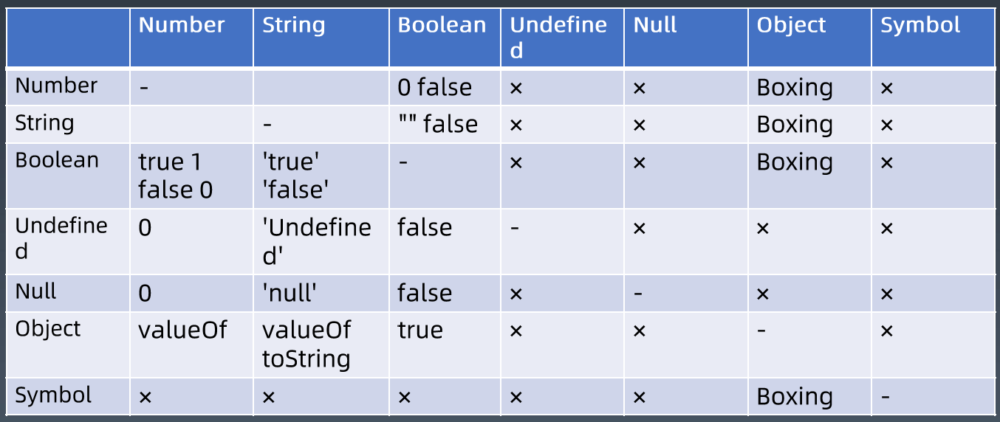

# 类型转换

[类型转换](http://www.ecma-international.org/ecma-262/10.0/#sec-abstract-operations)表示 JavaScript 中各个类型之间的转换。



上图中，从左往右读，表示从行到列的转变。比如 Object 类型，如果要转换成 Number 类型，需要执行 `Object.valueOf()` 方法。

## StringToNumber 的转换

- `Number()`

  ```javascript
  var n = Number("10");
  n; // 10
  ```

- `parseInt()`

  ```javascript
  var n = parseInt("1111", 2);
  n; // 15
  ```

- `parseFloat()`

  ```javascript
  var n = parseFloat("100.25");
  n; // 100.25
  ```

## NumberToString 的转换

- `toString()`

## 装箱

基本类型 Number、String、Boolean、Symbol 在 Object 类型中都有对应的类。所谓装箱转换，正是把基本类型转换为对应的 Object 类型，它是类型转换中一种相当重要的种类。

## 拆箱

Object 类型到 String 类型和 Number 类型的转换都遵循“先拆箱再转换”的规则。

拆箱转换会尝试调用 `valueOf()` 和 `toString()` 来获得拆箱后的基本类型，会优先选用 `valueOf()`。如果 `valueOf()` 和 `toString()` 都不存在，或者没有返回基本类型，则会产生类型错误 TypeError。

```javascript
var o = {
  valueOf: () => {
    console.log("valueOf");
    return {};
  },
  toString: () => {
    console.log("toString");
    return {};
  },
};

o * 2;
// valueOf
// toString
// TypeError
```

在 ES6 之后，还允许对象通过显式指定 `@@toPrimitive` Symbol 来覆盖原有的行为。它的优先级是最高的。

```javascript
var o = {
  valueOf: () => {
    console.log("valueOf");
    return {};
  },
  toString: () => {
    console.log("toString");
    return {};
  },
};

o[Symbol.toPrimitive] = () => {
  console.log("toPrimitive");
  return "hello";
};
console.log(o + "");
// toPrimitive
// hello
```

背后的工作原理是这样的：

1. 如果用户没有自定义 `@@toPrimitive`，会执行默认的 `@@toPrimitive`。在这里面会执行 `valueOf()` 和 `toString()`。
2. 如果用户自定义了 `@@toPrimitive`，相当于用户重载了默认的 `@@toPrimitive`，则只会执行用户自定义的，
