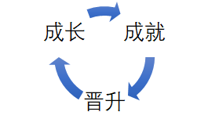
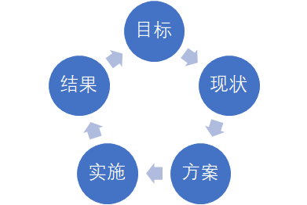

# 前端之路

一个优秀的工程师，需要同时具备以下几个条件：

- 拥有丰富的领域知识与基础知识，并能成体系
- 拥有能力（编程能力、架构能力、工程能力）和潜力
- 拥有清晰的职业规划

针对上面的条件，本前端之路项目主要完成：

- 构建成体系的前端知识
- 编程训练，提高编程能力
- 通过组件化以及工具链设计，提高工程能力

## 成体系的前端知识

前端知识主要指日常前端开发接触的知识，主要可分为：

- JavaScript
  - Grammar 文法
    - Lexical 词法
      - WhiteSpace
      - LineTerminator
      - Comment
      - Token
        - Identifier
        - Keywords
        - Punctuator
        - NumericLiteral
        - StringLiteral
        - RegularExpressionLiteral
        - Template
    - Syntax 语法
      - Atom
      - Expression
      - Structure
      - Script & Module
  - Semantics 语义
  - Runtime 运行时
    - Type
      - Number
      - String
      - Boolean
      - Null
      - Undefined
      - Object
      - Symbol
      - 内部类型
        - Reference
        - Completion Record
    - 执行过程
      - Job
      - Script/Module
      - Promise
      - Function
      - Statement
      - Expression
      - Literal
      - Identifier
- CSS
  - @rule
  - 普通 rule
    - 选择器
    - 属性
- HTML
  - HTML 作为计算机语言
    - 语法
    - 词法
  - HTML 作为 SGML
    - DTD 用于定义 HTML 可以用的标签、属性等。HTML 5 已经抛弃了这个东西，只用于致敬。
    - Entity 用于定义无法打印的字符或定义 HTML 中的保留字
  - HTML 作为 XML
    - Namespace 命名空间，用于区分不同 DTD 下相同的元素和属性
      - svg
      - mathml
      - aria
      - xhtml
    - Tag 用于描述网页的内容
- 宿主环境中的 API
  - Browser
    - DOM
      - Nodes
      - Ranges
      - Events
    - CSSOM
    - BOM
  - Node
  - 小程序

## 能力

- 编程能力 -> 能不能实现功能
- 架构能力 -> 能做多大的项目
  - 客户端架构
    - 解决软件需求规模带来的复杂性
  - 服务端架构
    - 解决大量用户访问带来的复杂性
  - 前端架构
    - 解决大量页面需求带来的重复劳动问题
      - 库 -> 有复用价值的代码
        - URL
        - AJAX
        - ENV
      - 组件 -> UI 上多次出现的元素
        - 轮播
        - Tab
      - 模块 -> 经常被使用的业务模块
        - 登录
- 工程能力 -> 能和多少人协作
  - 工具链
    - 作用
    - 分类
      - 脚手架
        - init
      - 本地调试
        - run
          - 项目启动
          - 打断点
      - 单元测试
        - test
      - 发布
        - publish
    - 体系的设计
      - 版本问题
      - 数据统计
  - 持续集成
    - Check-in build
    - Lint + Rule Check

## 职业规划

你是自己职业规划的规划者，一定要自己想清楚自己要做的事情。

一般在实际工作中，很少有既能提高技术水平，又能有得到不错薪资的工作。如果你发现了某个工作能同时符合两者，那你是很幸运的。如果工作中用到的技术偏向简单，为了提高技术水平，可以多参与开源项目。

## 职业发展

其中成就主要有：

- 业务型成就
  - 业务目标
    - 理解公司业务的核心目标
    - 目标转化为指标
  - 技术方案
    - 业务指标到技术指标的转化
    - 形成纸面方案、完成小规模试验
  - 实施方案
    - 确定是实施目标、参与人
    - 管理实施进度
  - 结果评估
    - 数据采集、数据报表
    - 向上级汇报
- 技术型成就
  - 目标
    - 公认的技术难点
  - 方案与实施
    - 依靠扎实的编程能力、架构能力形成解决方案
  - 结果
    - 问题解决
- 工程型成就
  - 目标
    - 质量、效率
  - 方案与实施
    - 规章制度
    - 库
    - 工具
    - 系统
  - 结果
    - 线上监控

## 数据驱动的思考方式

